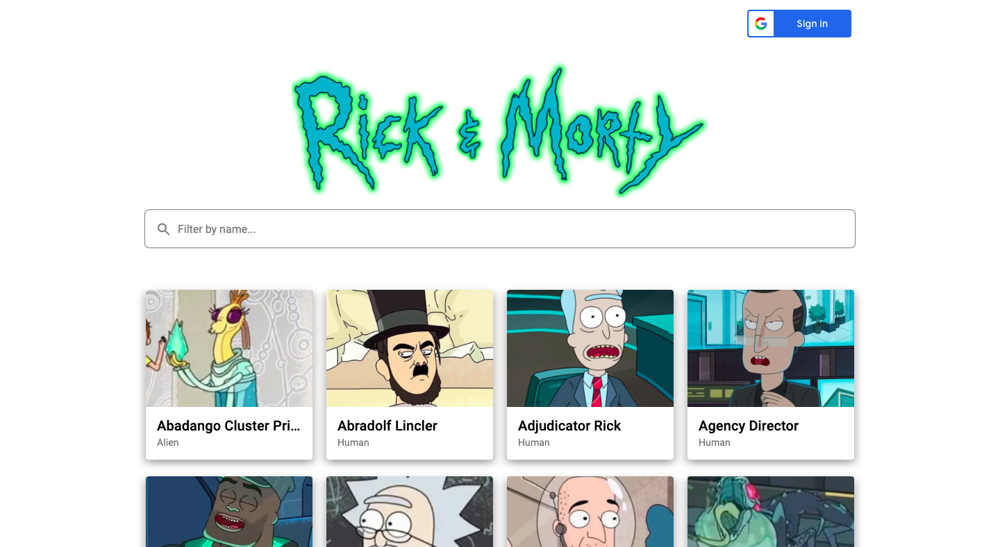
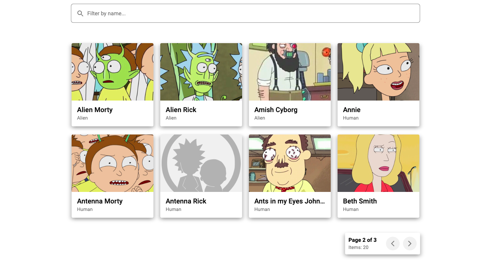
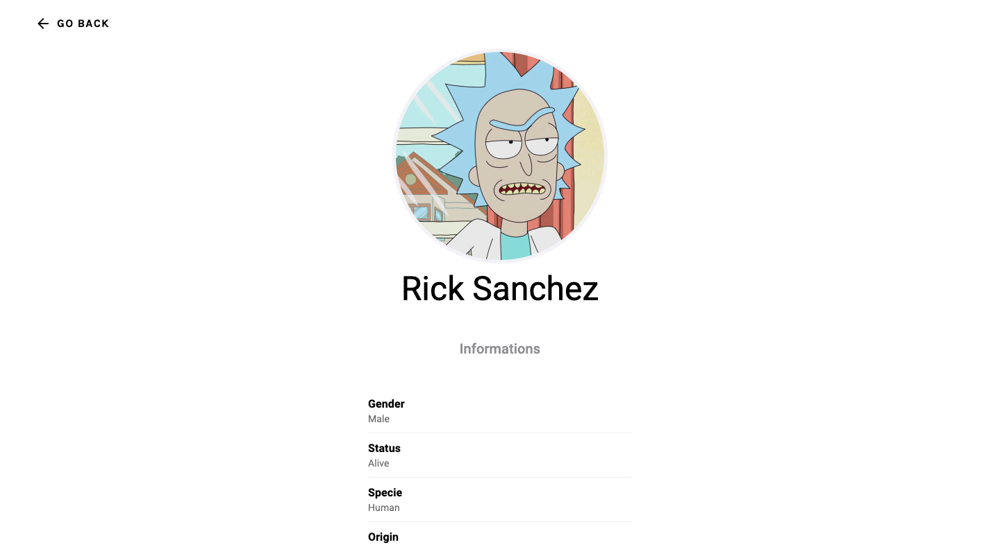
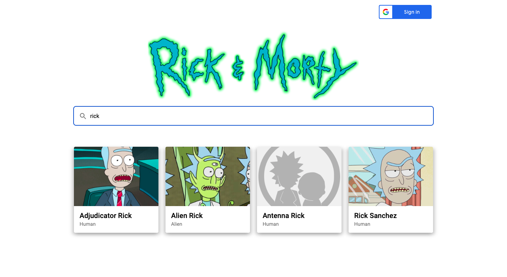

# Rick & Morty Characters Library

## Get Started

If you want to see the project without deploying it locally, you can follow this link to GitHub Pages: https://georgedeyneka.github.io/RickMortyCharactersLib/

So, if you want to look at the project's code and deploy it, follow the steps below in the "Installation" section.

### Installation

1. Clone the repo
```sh
git clone https://github.com/GeorgeDeyneka/RickMortyCharactersLib.git
```
2. Install NPM packages
```sh
npm install
```
3. Run this command for a dev server. Navigate to `http://localhost:4200/`. The application will automatically reload if you change any of the source files.
```sh
ng serve -o
```

## About project

This is my technical task, written in Angular. Here I am building a library based on an existing API.


### Built With

- 
- 
- 
- 
- 
- 
- 
- 


## Usage

### Main Page
<div>
  <ul>
    <li>
So, when you open the application, you see in front of you a small library consisting of Rick & Morty characters.
    </li>
    </br>
    <li>
You can log in with your Google account by clicking on the button.
    </li>
        </br>
    <li>
Also, when you enter the page, you will see a modal window asking you to sign in with your Google account. After authorization, you can also log out by clicking on the block with information about your account.
    </li>
  </ul>
  </br>

</div>

</br>

---

### Pagination
<div>
  <ul>
    <li>
Please note that pagination has been added to the application to facilitate page navigation.
    </li>
    </br>
    <li>
It works in conjunction with the browser's memory, so if you reload the page or view information about a certain character, don't worry: you will stay on the same page you were on.
    </li>
    </br>
    <li>
I wrote this pagination myself, without using any third-party libraries at all.
    </li>
  </ul>
  </br>

</div>

</br>

---

### Details Page
<div>
  <ul>
    <li>
When you click on a card with a character, you get to the details page.
    </li>
    </br>
    <li>
Here you can view brief information about the character, as well as return to the main page.
    </li>
  </ul>
  </br>

</div>

</br>

---

### Search
<div>
  <ul>
    <li>
You can also search for the characters you need.
    </li>
    </br>
    <li>
The search is case-insensitive, so if you write "RICK" or "ricK" for example, it won't affect the search results.
    </li>
    </br>
    <li>
The search also works in conjunction with memory, so that when you reload or navigate to other pages, your input data will be saved.
    </li>
  </ul>
  </br>

</div>

</br>


## Contributing

Contributions are what make the open source community such an amazing place to learn, inspire, and create. Any contributions you make are **greatly appreciated**.

If you have a suggestion that would make this better, please fork the repo and create a pull request. You can also simply open an issue with the tag "enhancement".

If you want to improve the project code, you need to:

1. Fork the Project
2. Create your Feature Branch (`git checkout -b feature/AmazingFeature`)
3. Commit your Changes (`git commit -m 'Add some AmazingFeature'`)
4. Push to the Branch (`git push origin feature/AmazingFeature`)
5. Open a Pull Request

Don't forget to give the project a star! Thanks again!


## My Contacts (Links)

- <a href="https://www.linkedin.com/in/george-deyneka-910003238/">
    
  </a> 
- <a href="https://t.me/Deyneka_George">
    
  </a> 
- <a href="mailto: zhoradeynecka@gmail.com">
    
  </a> 


## Acknowledgments

- I would like to thank the creators of <a href="https://rickandmortyapi.com/documentation/" target="_blank">JSONPlaceholder</a> for creating amazing API that was used in this project.
